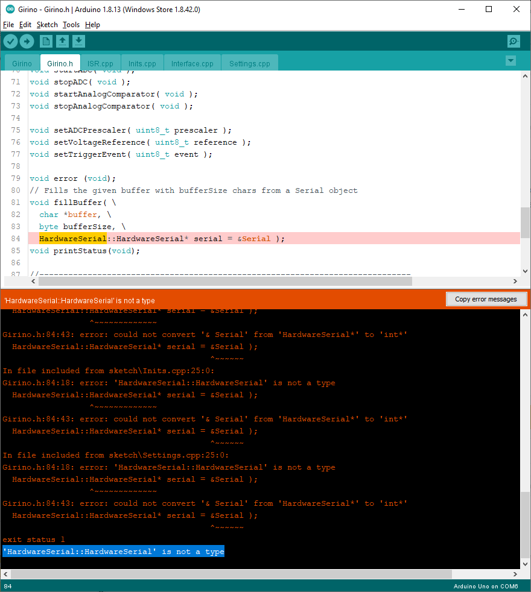
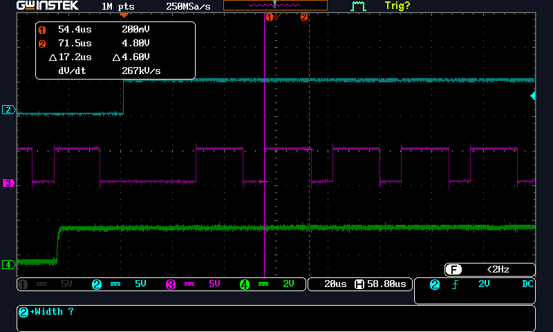

# Girino-Fork
A fork of Girino fixing the error "Girino.h:84:18: error: 'HardwareSerial::HardwareSerial' is not a type"

Girino was found at: https://www.instructables.com/Girino-Fast-Arduino-Oscilloscope/
The article is dated Mar 18th, 2012. 
However, in January of 2021 I got errors when trying to compile. 

Compile Errors: 
  
I infer the current practices and syntax of HardwareSerial.h has changed. 

## What I have done to the Girino
I fixed the code by using the new style of member functions  
The Serial member functions are now accessed with "dot" syntax.  
Example of code changes:  
```C++
// Fill buffer  
	for ( byte i = 0; i < limit; i++ ) {  
//FLE  dprint(serial->available());  
  dprint(Serial.available());  
		dprint(i);  
		dprint(buffer);  
  
//FLE    buffer[i] = serial->read();  
    buffer[i] = Serial.read();  
	}
```    
## What I have done to the readgirino.py
Once the Girino code compiled I tried running to aquire data on my Windows PC it with the file readgirino.py.  
The orignal code had a path to a linux serial port and I added a setup for my COM8. This produced errors running under Python 3 so I rewote to use the Python3  print function.
I also made the batch file RunReadingGirino.bat to allow me to exicute in a CMD windows the Python program to see results.  I added some descriptive comments to help me 
keep track of what the code was doing.
```Python
#Let's get and print status
	stream.write(bytes('d', 'utf-8'))
	for i in range(6):
		print(stream.readline())
```  

Using the batch file RunReadingGirino.bat, I found that the Girino never returned data.   
I have connected a 1KHz sqaure wave at 2Vp-p (0 to 2V) to AN0 and AN1 as I think thse are the input and triffer respectivly but am not succeding.
To furhter troubleshoot / explore the function of the Girino I extended the command set so I could force an end to data capture and then print 
out the resulting captured ADC data in a human friendly format.

Finaly to Girino I added a new command "c" which freezes the data and send it to the python file which then wrote a "data.txt" file.  
I documented all of the commands in the file, CommandList.txt
[Link to CommandList](CommandList.txt)

## Status: As of 20210210 
Trigger goes in on D7. I have set the comparitor positive refernce to the 1.1V band gap reference.
I have tested with the 1Khz 0-2Vp-p calibration waveform from my GDS1054B oscilliscope.
I instremented two more pins to track program flow into the trigger and into the A2D ISRs.
With the prescaler set on 128, 64, and 32 I get triggering and measurement of samples. However with prescale of 16, 8,4 or2 no triggering occoures. It looks like the A2D conversion can not happen faster. In fact the A2D conversion time seams to be fixed at 17uS.  
Waveforms:  
 "Ch1 off, CH2 Trigger, CH3 A2D high during conversion, CH4 Square Wave input.")  


## Status: As of 20210206 
I still have not figured out how to get the Girino to trigger on an imput signal.
I experimented with changing the Analog Comparitor setup to (I think) set the comparitor for AN1 input.
  
